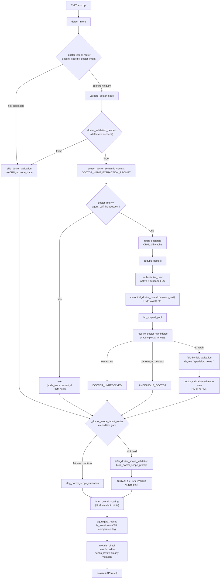

# The Doctors Pipeline

A complete, code-traced architecture walkthrough of the Doctor Validation and
Doctor Scope features in this project — every function, field, log line, and
CRM value below was read from the current repository (or a live CRM query)
during the session that produced this document, not summarized from memory.
No code was changed to produce it.

> **Legend** — steps below are tagged `[deterministic]` (plain Python/regex,
> no model call), `[LLM]` (a model call, non-deterministic), or `[CRM]`
> (reads Dynamics 365 doctor data).

---

## Table of contents

1. [Every file involved](#1-every-file-involved)
2. [The full pipeline, traced](#2-the-full-pipeline-traced)
3. [Two independent sub-features](#3-two-independent-sub-features)
4. [Pre-routing in graph.py](#4-pre-routing-in-graphpy)
5. [qa_prompt.py doctor extraction, in detail](#5-qa_promptpy-doctor-extraction-in-detail)
6. [Early skip / node-exit behavior](#6-early-skip--node-exit-behavior)
7. [CRM doctor retrieval](#7-crm-doctor-retrieval)
8. [OPD behavior — explicit and by design](#8-opd-behavior--explicit-and-by-design)
9. [Business Unit normalization](#9-business-unit-normalization)
10. [Name normalization & matching](#10-name-normalization--matching)
11. [Doctor resolution outcomes](#11-doctor-resolution-outcomes)
12. [Multi-doctor recommendation handling](#12-multi-doctor-recommendation-handling)
13. [Post-resolution factual validation](#13-post-resolution-factual-validation)
14. [Degree validation](#14-degree-validation)
15. [Specialty validation](#15-specialty-validation)
16. [Doctor notes / factual claims](#16-doctor-notes--factual-claims)
17. [Doctor Scope routing](#17-doctor-scope-routing)
18. [Clinical need detection](#18-clinical-need-detection)
19. [Doctor Scope evidence](#19-doctor-scope-evidence)
20. [Doctor Scope outcomes](#20-doctor-scope-outcomes)
21. [State fields](#21-state-fields)
22. [Output models](#22-output-models)
23. [Aggregation & scoring impact — the precise mechanics](#23-aggregation--scoring-impact--the-precise-mechanics)
24. [Persistence](#24-persistence)
25. [node_trace behavior](#25-node_trace-behavior)
26. [Logging catalogue](#26-logging-catalogue)
27. [Scenario walkthroughs](#27-scenario-walkthroughs)
28. [Known weaknesses & technical debt](#28-known-weaknesses--technical-debt)
29. [Deterministic vs LLM vs CRM](#29-deterministic-vs-llm-vs-crm)
30. [Performance considerations](#30-performance-considerations)
31. [Tests](#31-tests)
32. [Architecture diagram](#32-architecture-diagram)
33. [Final summary](#33-final-summary)

---

## 1. Every file involved

Grepping the repo for `doctor_validation`, `doctor_scope`, `doctor_role`,
`DOCTOR_UNRESOLVED`, `AMBIGUOUS_DOCTOR` and friends turns up exactly these
files — nothing doctor-related lives outside this list.

| File | Responsibility |
|---|---|
| `app/agent/graph.py` | Graph topology. Owns `_doctor_intent_router` and `_doctor_scope_intent_router` — the two conditional edges that decide whether `validate_doctor` / `infer_doctor_scope_validation` ever execute. |
| `app/agent/nodes.py` | Node bodies: `validate_doctor_node`, `skip_doctor_validation`, `extract_doctor_semantic_context`, `infer_doctor_scope_validation`, `skip_doctor_scope_validation`, plus the aggregation/scoring/integrity nodes that consume doctor outcomes. |
| `app/agent/state.py` | Declares the two doctor-related keys on `AgentState`: `doctor_validation`, `doctor_scope_validation`. Nothing else doctor-related is a state field — see §21. |
| `app/prompts/qa_prompt.py` | `DOCTOR_NAME_EXTRACTION_PROMPT` (semantic name/role extraction), `build_doctor_scope_prompt` (clinical suitability), and the doctor sections of `build_scoring_prompt` (how the final LLM should read a doctor PASS/FAIL). |
| `app/service_hub/doctor_validation.py` | The engine room — 3,700+ lines. Detection, self-introduction filtering, name matching, CRM pool building, BU canonicalization, factual field validation, and the scope-gate helpers. No LLM calls anywhere in this file. |
| `app/service_hub/crm_doctors.py` | The single CRM fetch point: `fetch_doctors()`. Thread-safe, 24h TTL-cached, never raises. |
| `app/service_hub/offer_search.py` | Owns the shared Arabic→English specialty alias table (`_AR_ALIAS`) and the ambiguous-service table (`_AMBIGUOUS_SERVICES`) — built for offer search, *reused* by doctor specialty validation rather than duplicated. |
| `app/service_hub/bank_validation.py` | Owns `_APP_BU_TO_CRM_BU` (the `LIVE → AHJ` table) — built for bank validation, reused by doctor validation for the same reason. |
| `app/models/input.py` | `CallTranscript.business_unit` and `BUSINESS_UNIT_KEYWORD_MAP` — the raw, application-level BU a call carries before doctor validation ever canonicalizes it. |
| `app/models/output.py` | `QAAnalysisResult.doctor_validation` / `.doctor_scope_validation` — both untyped `Optional[dict[str, Any]]`, not nested Pydantic models. |
| `app/SQL/doctors_query.sql` | The one query `crm_doctors.py` runs — `cr301_newdoctordataset` left-joined to `cr301_table1` for fees. |
| `app/services/sql_helpers.py` | `insert_qa_result` — where a doctor violation becomes a persisted row (indirectly, via `compliance_flags`; see §24). |
| `app/service_hub/README_doctor.md` | Design-note doc for the feature. Predates the semantic extraction layer, the self-introduction guard, and BU canonicalization added since — see the callouts in §5/§6. |
| `app/tests/test_doctor_validation.py` | 142 test functions covering detection, matching, degree/specialty/notes validation, multi-doctor sets. |
| `app/tests/test_doctor_scope_validation.py` | 41 test functions covering the clinical-suitability gate and LLM-facing evidence building. |
| `app/tests/test_graph_routing.py` | Graph-level tests asserting exactly-once execution, correct skip/run routing, and CRM-fetch call counts for the doctor branch specifically. |

---

## 2. The full pipeline, traced

Twelve real steps, in the order a call actually passes through them.

### 1 · `load_call` — `nodes.py` `[deterministic]`
- Input: `state["call"]` (a `CallTranscript`)
- Writes: `node_trace`
- Doctor relevance: none directly — but `CallTranscript.business_unit` is set here (via its own Pydantic validator, see §9), and every downstream doctor function reads it.

### 2 · `detect_intent` — `nodes.py` `[deterministic]`
- Writes: `is_booking_intent`, `intent_label`
- Doctor routing is a fully independent conditional edge off this same node — it does not read `is_booking_intent`.

### 3 · `_doctor_intent_router` — `graph.py:236` `[deterministic]`
- Calls `classify_doctor_context(call)` → `classify_specific_doctor_intent(call)`
- Reads only `state["call"]`
- Decision: `needed = ctx["doctor_intent"] != "not_applicable"`
- Logs (INFO): `doctor pre-routing | call_id=... business_unit=... doctor_role=... doctor_validation_needed=... reason=...`
- Logs (DEBUG): `doctor pre-routing diagnostics` — raw candidates, rejected fragments, per-turn lists

  - **`needed = False`** → edge to `skip_doctor_validation`. No CRM fetch, node never added to `node_trace`.
  - **`needed = True`** → edge to `validate_doctor`.

### 4a · `skip_doctor_validation` — `nodes.py:1663` `[deterministic]`
- Calls `extract_doctor_context_specialty(call)` — deterministic, unscoped fallback (no accepted doctor exists yet to scope to)
- Writes `doctor_validation = _not_applicable_doctor_result(specialty)` — **no `node_trace` entry**
- Logs: `[doctor] extraction: doctors=[] specialty_context=...` / `[doctor] outcome: N/A`
- CRM: never touched

### 4b · `validate_doctor_node` — semantic pre-check — `nodes.py:1743` `[deterministic]` `[LLM]`
First re-runs the same deterministic gate as a defensive fallback
(`doctor_validation_needed(call, signals)`). If it now says `False` — which
it never should in normal execution, since the router already checked it —
exits to N/A immediately, no LLM call. Otherwise calls
`extract_doctor_semantic_context(call, llm_client, state)`.
- Prompt: `DOCTOR_NAME_EXTRACTION_PROMPT` — see §5
- Returns: `(doctor_name, doctor_context_specialty, doctor_role)`
- Guard: if `doctor_role == "agent_self_introduction"`: exit to N/A **before** any CRM fetch — see §6

### 5 · `fetch_doctors()` — `crm_doctors.py:43` `[CRM]`
- Only reached if the semantic guard above did not exit
- Process-global, thread-safe, 24h TTL cache. Never raises — returns cached data (or `[]`) on failure.
- Failure state: empty result → `outcome="INSUFFICIENT_REFERENCE_DATA"`, non-punitive, `is_violation=False`

### 6 · `dedupe_doctors` → `authoritative_pool` → `bu_scoped_pool` — `doctor_validation.py` `[deterministic]`
- Order: `dedupe_doctors` (merge by `cr301_doctorkey`) → filter to Active + supported-BU (`authoritative_pool`) → filter again to `canonical_doctor_bu(call.business_unit)` (`bu_scoped_pool`)
- Logs: `doctor CRM records | fetched=N deduplicated=N authoritative=N opd_filtering=disabled`

### 7 · `resolve_doctor_candidates` — `doctor_validation.py:1294` `[deterministic]`
- Tried against `bu_scoped_pool`, then `authoritative_pool`, then `full_pool` — see §9/§10
- Tiers: exact name → safe partial (single-token allowed only for the semantic-vetted name) → fuzzy (≥90, 2+ tokens only)
  - 0 matches → `DOCTOR_UNRESOLVED`
  - 1 match → resolved, continue to field validation
  - 2+ matches, different keys → `AMBIGUOUS_DOCTOR` (unless a same-profile or same-BU tiebreak applies)

### 8 · Field-by-field factual validation — `_resolve_and_validate_one_doctor` `[deterministic]`
- Checks: degree, specialty/subspecialty, business_unit, doctor_notes, scope_of_service, qualifications, examination_age, walk-in fee — only fields the Agent actually mentioned
- Writes: `validated_fields` dict, per-field `PASS` / `FAIL` / `NEEDS_REVIEW`

### 9 · `doctor_validation` written to state `[deterministic]`
- `node_trace`: `validate_doctor` is appended *whenever this node ran* — including a semantic-guard early exit (see §25)

### 10 · `_doctor_scope_intent_router` — `graph.py:287`, off `fetch_crm_offers_for_call` `[deterministic]`
- Reads `state["doctor_validation"]` (must already exist — this is why the router sits after the booking split, not before)
- Calls `doctor_scope_validation_needed` / `doctor_scope_skip_reason` — the 4-condition gate, see §17

### 11a/11b · `infer_doctor_scope_validation` / `skip_doctor_scope_validation` — `nodes.py:1926 / 2088` `[deterministic]` `[LLM]`
- Prompt: `build_doctor_scope_prompt` — only the already-resolved doctor's CRM fields, never the full dataset, never asked to pick a doctor
- Writes: `doctor_scope_validation`

### 12 · `infer_overall_scoring` → `aggregate_results` → `integrity_check` → `finalize` — `nodes.py` `[deterministic]` `[LLM]`
Both doctor dicts are serialized whole into the scoring prompt (LLM
judgment), **and** `aggregate_results` deterministically turns
`is_violation=True` into a `type=C2B` compliance flag, **and**
`integrity_check` deterministically force-upgrades a `"pass"` verdict to
`"needs_review"` if either doctor dict is a violation. Full detail in §23.

---

## 3. Two independent sub-features

The single phrase "doctor validation" actually names two checks that never
merge, live in different state keys, and run on different graph hops.

### A · Doctor Information Validation
`doctor_validation.py` · **deterministic, no LLM**

Validates *identity* and *factual claims* — did the agent say something true
about a specific, named physician?

- **Implemented now:** name/CRM identity, business unit, degree, specialty,
  subspecialty, doctor notes, scope-of-service (as a factual claim overlap
  check, not a suitability judgment), qualifications, examination-age
  eligibility, walk-in fee.
- Every field is optional — a field the agent never mentioned never appears
  in `validated_fields` at all.
- Output key: `state["doctor_validation"]`.

### B · Doctor Scope / Clinical Suitability
`build_doctor_scope_prompt` + `infer_doctor_scope_validation` · **LLM**

Judges *fit* — given a doctor A already resolved, does their documented CRM
scope reasonably cover what the patient described?

- Runs only after A has resolved a doctor *and* the patient described a real
  clinical need.
- The LLM is handed only that one doctor's summarized CRM fields — it is
  structurally incapable of picking a different doctor.
- Only `UNSUITABLE` counts as a violation (`is_violation=True`). `UNCLEAR`
  is the deliberate "we don't know" default and is never penalized.
- Output key: `state["doctor_scope_validation"]`.

> The separation is enforced structurally, not just by convention:
> `build_doctor_scope_prompt`'s docstring states the LLM "must NEVER be
> asked to pick a doctor itself" — its `doctor_reference` parameter is built
> from *one already-resolved* CRM record's summarized fields
> (`_summarize_doctor`), never the full doctor dataset.

---

## 4. Pre-routing in graph.py

`_doctor_intent_router` is a conditional edge off `detect_intent` — a cheap,
regex-only pre-check, never the authoritative extraction.

```python
def _doctor_intent_router(state: AgentState) -> Literal["validate_doctor", "skip_doctor"]:
    call = state["call"]
    ctx = classify_doctor_context(call)          # = classify_specific_doctor_intent(call)
    needed = ctx["doctor_intent"] != "not_applicable"
    ...
    return "validate_doctor" if needed else "skip_doctor"
```

`classify_specific_doctor_intent` (`doctor_validation.py:3199`, 380+ lines)
is the *single* deterministic classifier — the router,
`validate_doctor_node`'s defensive fallback, and `doctor_validation_needed()`
all call the exact same memoized function, so there is never a looser check
in one place and a stricter one in another.

### doctor_role values

| Role | What it means |
|---|---|
| `patient_selected` | Patient explicitly booked/chose one specific named doctor. |
| `agent_recommended` | Agent proposed a doctor (in reply to "which doctor is suitable?", or a list of options). |
| `doctor_booking_confirmed` | Same fallback path as `agent_recommended` (patient never named anyone), but the turn is a bare transactional confirmation ("تم تأكيد حجزك مع...") — *not* scope-eligible, unlike a genuine recommendation. |
| `doctor_inquiry` | Patient is asking something specifically about a named doctor. |
| `ordering_or_referring` | The doctor only ordered/referred a *different* service (e.g. an MRI) — never a booking/inquiry target for that doctor themself. |
| `existing_doctor_reference` | An existing/follow-up relationship mentioned as context for something else. |
| `administrative_reference` | Bare addressee/context mention with no clinical target attached. |
| `agent_self_introduction` | The only doctor-shaped name found was the Agent naming themselves. |

### The actual doctor_validation_needed condition

There is no single boolean expression — it's the outcome of per-clause
analysis in `_classify_specific_doctor_intent_impl`. The closest real
equivalent:

```python
# doctor_validation.py:1169
def doctor_validation_needed(call, signals=None) -> bool:
    return classify_specific_doctor_intent(call)["doctor_intent"] != "not_applicable"
```

`doctor_intent` becomes `"specific_doctor_booking"` or
`"specific_doctor_inquiry"` — never merely because a name appears — only
when one of these holds, evaluated **per clause** (via `_split_clauses`,
splitting on commas/newlines/"لأن"/"عشان" so an unrelated clause's verb
never attaches to a doctor named elsewhere in the same turn):

- An active booking verb (`_ACTIVE_BOOKING_VERB_RE`) and a دكتور/طبيب title
  are within ~20 characters of each other in the same clause
  (`_DOCTOR_BOOKING_ATTACH_RE`), *and* the title isn't immediately followed
  by a specialty/role word (`_title_is_role_reference` — "دكتور عظام"
  fails this).
- The patient asked for "a suitable doctor" with no name, and the Agent
  later names one — that fallback sets `doctor_role="agent_recommended"`
  and `named_doctor=agent_candidates[0]`, *unless* the agent's naming turn
  itself contains an ordering marker.
- A bare, targetless active-verb clause inherits "doctor" as its target only
  from an `_EXISTING_RELATIONSHIP_RE` clause earlier in the call — never
  from a mere ordering mention.
- The cross-turn "which doctor?" exchange: an Agent clarifying question
  (`_WHICH_DOCTOR_QUESTION_RE`) followed by a bare-name Patient reply
  (`_bare_reply_name_candidate`) — the reply counts even with no
  دكتور/طبيب title of its own.

> **Known weakness — the pre-router can be more eager than the semantic
> extraction.** The router only asks "is a name-shaped title-plus-word
> attached to a booking/inquiry verb?" It has no idea whether that word is a
> real name until `extract_doctor_turn_candidates`/`is_plausible_person_name`
> run inside the same classifier — and even then, `is_agent_self_introduction`
> is checked *before* a candidate is accepted, using its own separate regex
> (`_SELF_INTRO_RE`). If a self-introduction phrasing isn't covered by that
> regex, the router can still emit `doctor_role=patient_selected`/
> `doctor_validation_needed=True` for a turn that's really just the agent
> naming themselves — `validate_doctor_node`'s semantic LLM guard (§6)
> exists specifically as the second line of defense for exactly this gap.

---

## 5. qa_prompt.py doctor extraction, in detail

`DOCTOR_NAME_EXTRACTION_PROMPT` is a dedicated prompt — it never reuses or
calls the appointment-extraction flow, and it runs regardless of booking
intent (a doctor can come up without a booking).

### What it's asked to extract

Exactly four JSON keys, nothing else:

```json
{
  "doctor_name": "<fullest plausible human name, or null>",
  "doctor_role": "<agent_self_introduction | patient_selected |
                   agent_recommended | booking_confirmation | mention | null>",
  "doctor_context_specialty": "<specialty/service phrase, or null>",
  "doctor_validation_needed": true|false
}
```

### Rule #1 (highest priority) — self-introduction

The prompt opens with this rule before anything else:

| Pattern | Outcome |
|---|---|
| `مع حضرتك دكتور محمد` | `doctor_name=null`, `doctor_role="agent_self_introduction"`, `doctor_validation_needed=false` |
| `مع حضرتك د ابانوب من قسم الرعاية المنزلية` | same |
| `انا الدكتور محمد` / `أنا دكتور يوسف` | same |
| `this is Dr X` / `I'm Dr X` | same |
| `Patient: حياك الله دكتور محمد` *(after the agent introduced themselves as محمد)* | Still agent identity — a patient greeting/thanks never converts the addressee into `patient_selected`. |
| `متاح معانا دكتور شريف` | `شريف` = `agent_recommended` — a genuine target, not a self-intro |

The rule applies per-turn ("a call can be transferred through multiple
agents... NONE of those names is ever a doctor target") and is explicitly
non-global: a later, independent mention of a real third-party doctor —
even sharing a first name with an agent who introduced themselves earlier —
is still extracted normally.

### Rule #2 — only a plausible human name

An explicit rejection list, verbatim from the prompt:

- verb/fragment: `بعدين، بتكتب، بيكون`
- specialty/service word: `اورام، عصب، مخ واعصاب` — "دكتور اورام" means the
  specialty is Oncology, not a doctor literally named اورام
- department/team name: `التمريض` (nursing), `قسم الاشعة`
- generic role: `الطبيب المعالج، الطبيب المختص، زيارة طبيب، اخصائيين ممتازين`
- restrictive/quantifying word attached to a title: `دكتور فقط` = "male
  doctors only" — `فقط` is excluded even when two real names follow it on
  the next lines

A doctor name may be a single first-name token when that's genuinely all
the conversation states (never padded to two), and when the same doctor
appears at different completeness levels, only the fullest form is
returned.

### Are these protections LLM-only, deterministic, or both?

**Both, deliberately layered.** The prompt is the primary quality bar for
the *single-doctor* path (its output can replace the raw regex candidate as
the CRM query — see `validate_doctor_information`'s `semantic_doctor_name`
parameter). But a genuine **multi-doctor recommendation list** ("دكتور فقط
/ دكتور شريف / ودكتور احمد") never reaches the semantic layer at all — that
path is decided entirely by `classify_specific_doctor_intent`'s
deterministic candidate extraction. So the exact same garbage words (`فقط`,
`بيكون`, `التمريض`) are *also* hard-blocked in `doctor_validation.py`'s own
word lists (`_NON_NAME_FIRST_WORDS`, `_GENERIC_SPECIALTY_WORDS`) — defense
in depth, not redundancy for its own sake.

---

## 6. Early skip / node-exit behavior

The exact order of operations inside `validate_doctor_node`, and exactly
which line exits without a CRM fetch:

1. `detect_doctor_signals(call)` — cheap, deterministic.
2. **Gate 1** (line 1777): `if not doctor_validation_needed(call, signals): return N/A` — defensive re-check of the router's own decision. No LLM call is even attempted here.
3. `await extract_doctor_semantic_context(call, llm_client, state)` — the **one** LLM call this node ever makes.
4. **Gate 2** (line 1782): `if semantic_role == "agent_self_introduction": return N/A` — **this is the exact line.** Everything after it — the `from app.service_hub.crm_doctors import fetch_doctors` import and the `fetch_doctors()` call — is never reached.
5. Only past both gates: `fetch_doctors()`, dedup, BU scoping, matching, field validation.

```python
semantic_name, semantic_specialty, semantic_role = await extract_doctor_semantic_context(call, llm_client, state)
if semantic_role == "agent_self_introduction":
    result = _not_applicable_doctor_result(semantic_specialty)
    # ... print the clean [doctor] extraction / outcome block ...
    return {"doctor_validation": result, "node_trace": _trace(state, "validate_doctor")}

# only reached if Gate 2 did not fire:
try:
    from app.service_hub.crm_doctors import fetch_doctors
    doctors = fetch_doctors()
```

> **Why Gate 2 only ever fires on a positive string.**
> `extract_doctor_semantic_context` degrades to `doctor_role=None` on any
> failure — a bad LLM response, a parse error, or (in tests) a stub client
> returning `"{}"`. `None` never equals `"agent_self_introduction"`, so the
> guard can only ever *skip* a call the LLM actively, positively classified
> as a self-introduction — it can never accidentally turn a real,
> resolvable doctor call into a false N/A just because the LLM had nothing
> to say.

### Yes, validate_doctor still appears in node_trace when the outcome is N/A

Both gates return through the node's own normal return statement, and both
include `"node_trace": _trace(state, "validate_doctor")`. The node *ran* —
it just decided quickly. Only the graph-level `skip_doctor_validation` path
(taken when the *router* already said "not needed," before the node ever
executes) omits the trace entry — see §25 for the full distinction.

---

## 7. CRM doctor retrieval

`app/SQL/doctors_query.sql`, executed once (per cache window) by
`crm_doctors.fetch_doctors()`:

```sql
SELECT D.[cr301_title], D.[cr301_doctorkey], D.[servhub_doctornameen], D.[cr301_doctornamear],
       D.[cr301_degreename], D.[cr301_specialtyname], D.[cr301_subspecialtyname],
       D.[cr18c_manualspecialtyname], D.[cr18c_manualsubspecialtyname],
       D.[cr301_contracttypename], D.[cr301_businessunitname], D.[cr18c_buname],
       D.[cr301_nationalityname], D.[statuscodename], D.[cr301_opdflag],
       D.[cr18c_exclusivenessname], D.[cr301_stardoctorname], D.[cr18c_firstpriorityname],
       D.[cr301_drnotes], D.[cr301_scopeofservice], D.[cr301_scopeofservicear],
       D.[cr301_qualificationsandexperience], D.[cr301_qualificationsandexperiencear],
       D.[servhub_examinationage], D.[cr603_insuranceissues], D.[cr603_staffexlimitation],
       D.[cr301_flag],
       F.[cr301_originalconsultationfees], F.[cr301_walkinconsultationfees],
       F.[cr301_contractconsultationfees], F.[cr301_affiliateconsultationfees]
FROM [dbo].[cr301_newdoctordataset] AS D
LEFT JOIN [dbo].[cr301_table1] AS F ON D.[cr301_doctorkey] = F.[cr301_doctorkey]
ORDER BY D.[cr301_doctorkey];
```

No `WHERE` clause at all — **every** row comes back, OPD or not, active or
not, any BU. All filtering happens in Python afterward, because it depends
on this project's own vocabulary (the supported-BU allowlist), not a raw
CRM value.

### Caching & retry

- **Cache:** a module-level dict (`_cache`) guarded by a `threading.Lock` —
  process-global, not per-call. TTL = `settings.CRM_PRICE_CACHE_TTL_SECONDS`,
  default **86,400s (24h)**.
- **Backoff:** after a failed fetch, retries are suppressed for 5 minutes
  (`_cache["failed"]` + `age < 300`).
- **Retry:** `_run_query_with_retry` (in `crm_connector.py`) retries up to 3
  times on transient connection/token errors before giving up.
- **Failure mode:** never raises — returns cached (possibly empty) data.
  Doctor validation degrades to `INSUFFICIENT_REFERENCE_DATA`, never a
  crash.

A real fetch observed this session: `Fetched 4063 doctor record(s)`.

### Deduplication

`dedupe_doctors` groups rows by `cr301_doctorkey` and merges each group with
`_merge_duplicate_rows`: **first non-null/non-empty value per field wins**
across the group. When two rows in the same group disagree on
`cr301_degreename`, `cr301_specialtyname`, or `cr18c_buname`, it logs —
never silently drops the conflict:

```python
logger.warning(
    "doctor duplicate rows conflict | doctor_key=%s field=%s values=%s — using first non-empty",
    rows[0].get("cr301_doctorkey"), field, sorted(values),
)
# e.g. doctor_key=110042 field=cr301_specialtyname values=['Neuro Surgery', 'Neurosurgery']
```

A *separate* real-data quirk — the same physical doctor under two
*different* keys — is handled later, at resolution time: if every tied
candidate shares an identical name *and* identical degree/specialty/
subspecialty/BU, resolution proceeds safely with one of them; otherwise it
correctly reports `AMBIGUOUS_DOCTOR`.

### What "authoritative" means here

```python
def authoritative_doctor_pool(doctors):
    return [r for r in doctors if _is_active(r) and is_supported_doctor_bu(r.get("cr18c_buname"))]
```

Two conditions, both mandatory, neither is OPD:

1. `statuscodename` normalizes to `"active"`.
2. `cr18c_buname` (not `cr301_businessunitname` — see §9) is one of
   `{AKW, AHJ, HJH, ALW, ADC, LCH, AFW}`.

Identity resolution is attempted against the **full deduplicated pool
first** — a doctor who exists but fails one of these two conditions can
still be recognized and reported as `FAIL` ("recommending an inactive/
unsupported-BU doctor"), never a bare, uninformative "no such doctor."

---

## 8. OPD behavior — explicit and by design

> **`cr301_opdflag` filtering is disabled, on purpose.** It is fetched and
> carried on every doctor record as *informational metadata only* — visible
> in logs and in the resolved-doctor evidence — but it never determines
> whether a doctor is searchable.

Where this lives: `_is_active()`'s own docstring explains it directly — a
doctor who isn't flagged OPD (a home-care or other non-OPD service context,
the exact real-world case this generalizes from: `اسامة عبد السلام`) can
still be a genuine, resolvable doctor. The function is named `_is_active`,
not the historical `_active_opd`, precisely because OPD is no longer part
of what it checks.

**What remains active as a filter:** Active status, and the supported-BU
allowlist — both applied by `authoritative_doctor_pool`/inline in
`validate_doctor_information`.

**What must not be confused with OPD filtering:** the BU allowlist and
Active-status check are separate, still-enforced conditions. Logs like
`OPD filtering: disabled (opd_flag is informational only, not a
searchability gate)` and `opd_flag='OPD' (informational only, not a
searchability gate)` exist specifically to make this distinction visible at
runtime, not just in code comments.

---

## 9. Business Unit normalization

Two *different* BU vocabularies meet here, and doctor validation must
translate between them before comparing anything.

### Where the raw value comes from

`CallTranscript.business_unit` (`models/input.py`) is set either
explicitly, or inferred by a model validator (`detect_business_unit`) that
scans the transcript text against `BUSINESS_UNIT_KEYWORD_MAP` — a table
that maps free-text aliases (`"AHJ"`, `"BU-AHJ"`, `"جدة"`) to this
project's own *application-level* label. Notably, that map sends the
keyword `"AHJ"` itself *to* `"LIVE"` — the opposite direction from what
doctor validation needs.

### The canonical conversion

```python
# doctor_validation.py:108 — imports _APP_BU_TO_CRM_BU from bank_validation.py,
# does NOT define a second table
def canonical_doctor_bu(bu):
    if not bu: return None
    bu_upper = str(bu).strip().upper()
    return _APP_BU_TO_CRM_BU.get(bu_upper, bu_upper)  # {"LIVE": "AHJ"} — verified against real CRM data
```

The table itself is owned by `bank_validation.py`
(`_APP_BU_TO_CRM_BU = {"LIVE": "AHJ"}`, "verified against real Dynamics 365
cr301_bankaccounts data — CRM rows use 'AHJ', never 'LIVE'") — doctor
validation imports it rather than defining a parallel copy, so the two
features can never drift apart on what `LIVE` means.

### Why this log is correct

```text
requested_business_unit='LIVE'
canonical_business_unit='AHJ'
resolved_business_unit='AHJ'
bu_scoped=True
```

The call's own `business_unit` field literally says `"LIVE"` — that's what
the conversation-layer code produced. But no CRM doctor row ever carries
`cr18c_buname="LIVE"`; real rows say `"AHJ"`. `canonical_doctor_bu("LIVE")`
resolves the alias *before* the BU-scoped pool is even built, so the
comparison that matters (`bu_scoped_pool` filtering, the ambiguity
tiebreak) runs entirely on the canonical value. `bu_scoped=True` means the
doctor was actually found within that BU-scoped pool, not the wider
unscoped one.

### cr18c_buname vs cr301_businessunitname

> `cr18c_buname` is authoritative. Real CRM data has been observed to
> *disagree* between the two fields on the same row — every BU comparison
> in this module (the supported-BU allowlist, `bu_scoped_pool`, the
> ambiguity tiebreak) reads `cr18c_buname` exclusively.
> `cr301_businessunitname` is fetched and carried through, but never
> compared against anything.

### Fallback when BU is unknown, and cross-BU ambiguity

If `canonical_doctor_bu(call_bu)` isn't a supported BU (unknown/missing),
`bu_scoped_pool` stays empty and resolution falls straight through to the
unscoped `authoritative_pool` — same-BU scoping is a *preference*, never a
hard requirement. If the same name matches records in two different BUs and
the call's own BU can pick exactly one, that one wins (via `bu_scoped_pool`,
or the last-resort `bu_matches` tiebreak in
`_resolve_and_validate_one_doctor`). If the call's BU is unknown *and*
multiple BUs still tie, the result is `AMBIGUOUS_DOCTOR` — the code never
guesses a BU to break the tie.

---

## 10. Name normalization & matching

### Normalization layer

`normalize_arabic_text` (shared, `text_helpers.py`) — lowercases, folds
hamza variants (أ/إ/آ/ٱ → ا), unifies ة→ه and ى→ي, strips all punctuation to
spaces, collapses whitespace. `_strip_title` additionally removes a leading
دكتور/طبيب/د./Dr title *before* this normalization runs (titles need their
own regex, since normalization would otherwise make title-stripping
ambiguous).

### The matching tiers (resolve_doctor_candidates)

| Tier | Rule | Notes |
|---|---|---|
| 1–2 · Exact | Full-string equality against `cr301_doctornamear` or `servhub_doctornameen`, post-normalization. | Tried first, always. |
| 3 · Safe partial | `_ordered_prefix_match` OR `_given_and_family_name_match` | Single-token queries only reach this tier when `allow_single_token=True` — set *only* for a semantic (LLM-vetted) name, never a raw regex fragment. |
| 4 · Fuzzy | `rapidfuzz.fuzz.ratio` ≥ 90 (full-string, not `token_set_ratio`) | Never relaxed for single tokens, even with `allow_single_token=True` — a fuzzy score on one word is too easy to fake. |

**`_ordered_prefix_match`** — the shorter of two token sequences must be an
exact, *ordered* prefix of the longer — never a same-length name with a
token swapped, never an unordered bag of shared words.

**`_given_and_family_name_match`** — both the *first* token (given name)
and the *last* token (family name) must agree, regardless of length or
middle tokens — this is what lets a middle father's-name be omitted safely.

**`is_plausible_same_person_name`** — accepts if *either* of the above
holds. Both independently reject a same-length name with any discriminating
token swapped.

### Worked examples

| Query | CRM name | Result | Why |
|---|---|---|---|
| `أسامة عبد السلام` | `اسامه عبد السلام` | ✅ match | Identical after normalization (hamza/teh-marbuta folding). |
| `اسامة عبد السلام` | `اسامة عبد المقصود` | ❌ reject | Same length, same first two tokens, but the final *discriminating* token conflicts — neither prefix nor endpoint match holds. |
| `محمد احمد` | `محمد علي` | ❌ reject | Given name matches, family name doesn't — endpoint match fails. |
| `احمد عبد الرحمن` | `احمد عبد العزيز` | ❌ reject | Same pattern — "عبد" alone carries no discriminative value; whatever follows it must also align. |
| `وصال` | `وصال محمد` | ✅ partial match | Single-token query is an ordered prefix of the CRM name — *only* reachable when the query came from the semantic layer. |
| `وصال احمد` | `وصال محمد` | ❌ reject | Once the chat supplies a second, discriminating token, it must align too — same length, endpoints conflict. |

### Why a single first name needs strong context

By default (`allow_single_token=False`), a one-token query can *only*
resolve via an exact full-string match — "محمد"/"أحمد" alone will never
partial-match, because a bare first name is too common to trust from
unvetted text (the CRM dataset also contains non-human operational rows —
"MRI .", "X Ray Male", "TEST Doctor" — that pass the same Active+BU filter
real doctors do). Single-token partial matching is unlocked *only* for the
name `extract_doctor_semantic_context`'s LLM already vetted as a real human
name — the "strong doctor context" is the semantic layer's own judgment,
not a looser matching rule for everyone.

---

## 11. Doctor resolution outcomes

| Outcome | Meaning | is_violation |
|---|---|---|
| `NOT_APPLICABLE` | No semantic doctor target at all — self-introduction, generic role, garbage extraction. Never reaches CRM. | False |
| `INSUFFICIENT_REFERENCE_DATA` | CRM fetch failed or returned empty. System condition, not an agent error. | False |
| `DOCTOR_UNRESOLVED` | A *legitimate* semantic target existed, but no CRM record matched it (in any pool, up to and including `full_pool`). | False |
| `AMBIGUOUS_DOCTOR` | 2+ equally plausible CRM records (different keys, different profiles, no BU tiebreak available). | False |
| `FAIL` (outside scope) | The name resolved, but only in `full_pool` — the doctor exists but is inactive or outside the supported BU list. | True |
| `FAIL` (factual) | Resolved and authoritative, but at least one agent-stated claim doesn't match CRM. | True |
| `PASS` | Resolved, authoritative, every checked claim matches (or nothing was claimed at all). | False |

> `DOCTOR_UNRESOLVED` means exactly one thing: **a real semantic doctor
> target existed, but CRM search came up empty.** It is explicitly *not*
> what happens for garbage extraction, an agent self-introduction, or a
> generic doctor reference — those are filtered out long before CRM search
> even starts, and land on `NOT_APPLICABLE` instead. The scoring prompt
> (§23) makes this distinction explicit to the final LLM: "a bare
> unresolved/ambiguous result on its own must not lower the score."

---

## 12. Multi-doctor recommendation handling

"دكتور شريف / ودكتور احمد" — a genuine recommendation SET, decided by
`classify_specific_doctor_intent`'s per-turn structural check: an Agent turn
listing 2+ bare "&lt;title&gt; &lt;name&gt;" clauses with no active verb and
no service noun in any of them.

1. `named_doctor_candidates = recommended_doctors` (2+ entries) whenever a
   genuine list is detected — vs. a single scalar for the ordinary
   one-doctor case.
2. `validate_doctor_information` branches on `len(named_doctor_candidates)
   <= 1`: single path unchanged; 2+ calls
   `_resolve_and_validate_one_doctor([name], **kwargs)` once *per name*,
   against the **same already-fetched/deduplicated/BU-filtered pools** —
   CRM is never re-fetched per doctor (confirmed by
   `test_multi_doctor_crm_fetched_once`).
3. Each doctor gets a full, independent result (own resolution, own
   `validated_fields`) — the first doctor's outcome never stands in for the
   set.
4. `_aggregate_doctor_recommendation_outcomes` combines them:

| Condition | Aggregate outcome |
|---|---|
| Any doctor `FAIL` | `FAIL` (one or more recommended doctors failed validation) |
| None resolved | `DOCTOR_UNRESOLVED` |
| Some resolved, some not (no FAIL) | `DOCTOR_UNRESOLVED` (names the unresolved ones in `reason`) |
| All resolved, all `PASS` | `PASS` |

Top-level scalar fields (`doctor_key`, `scope_reference`, ...) mirror the
*first* doctor for backward compatibility with single-doctor consumers; the
authoritative multi-doctor evidence lives in `result["doctors"]` (a list).
Doctor Scope (§17-20) mirrors this exact same split —
`infer_doctor_scope_validation` judges every independently-resolved doctor
concurrently via `asyncio.gather`, still within one graph node/hop.

### Limitation

Per-doctor specialty and degree claims are linked by re-scoping extraction
to *that specific name's own turn* (`_specialty_context_for_resolved_name` /
`_agent_turns_text_for_doctor`) rather than the classifier's single shared
`doctor_context_specialty` scalar — but conversational *pairing* (which
specific specialty phrase in a longer recommendation turn belongs to which
of several names) is still turn-level, not clause-level, for these two
fields specifically. A turn naming several doctors with genuinely different
specialties interleaved in the same sentence is not guaranteed to attribute
each specialty to the correct name.

---

## 13. Post-resolution factual validation

Every check below lives in `_resolve_and_validate_one_doctor`, runs *only*
after a doctor resolved, and only for fields the Agent actually said
something about.

| Field | Extraction source | CRM reference | PASS | FAIL | NEEDS_REVIEW / skip |
|---|---|---|---|---|---|
| `degree` | `_extract_degree_claim`, scoped to this doctor's own turns | `cr301_degreename` | Canonical claim == canonical CRM value | Explicit rank claimed, doesn't match | no claim at all → field absent |
| `specialty` | `_resolve_specialty_category`, scoped to this doctor | `cr301_specialtyname` / `cr18c_manualspecialtyname` | Core token matches (substring, either direction) | Category resolved, no field supports it | all 4 specialty fields empty → NEEDS_REVIEW |
| `subspecialty` | same claim, checked when specialty itself doesn't match | `cr301_subspecialtyname` / `cr18c_manualsubspecialtyname` | Core token matches | — | reported under the `specialty` key |
| `business_unit` | literal `cr18c_buname` string found (lowercased) in agent text | `cr18c_buname` | Always PASS when triggered (it's a literal-substring check) | — | no literal BU code spoken → field absent |
| `doctor_notes` | `_NOTES_CLAIM_TRIGGER_RE` ("لا يستقبل", "لا يوجد", "new cases only"...) | `cr301_drnotes` | Meaningful-word overlap (`_overlap_supports_claim`) | Triggered, no overlap | CRM notes empty → NEEDS_REVIEW |
| `scope_of_service` | `_SCOPE_CLAIM_TRIGGER_RE` ("يعالج", "متخصص في"...) | `cr301_scopeofservicear` / `en` | Overlap | Triggered, no overlap | CRM scope empty → NEEDS_REVIEW |
| `qualifications` | `_QUALIFICATION_CLAIM_TRIGGER_RE` ("بورد", "زمالة", "ماجستير"...) | `cr301_qualificationsandexperience(ar)` | Overlap | Triggered, no overlap | CRM field empty → NEEDS_REVIEW |
| `examination_age` | `_extract_examination_age_claim` (age-range/above/children/adults-only phrasing) | `servhub_examinationage`, parsed by `parse_examination_age` | Claim within parsed range | Claim contradicts parsed range | CRM text unparseable → NEEDS_REVIEW |
| `walkin_fee` | `_extract_fee_claim` (a stated riyal amount) | `cr301_walkinconsultationfees` | `abs(claim - crm) < 1` | Otherwise | CRM fee missing → NEEDS_REVIEW |

### Overall outcome from validated_fields

```python
outcomes = [v["outcome"] for v in validated.values()]
if "FAIL" in outcomes:
    outcome, reason = "FAIL", "One or more Agent-stated doctor details do not match the authoritative CRM record."
else:
    outcome, reason = "PASS", "All Agent-stated doctor details that could be checked match the authoritative CRM record."
```

**Any single FAIL** among the checked fields fails the whole doctor.
`NEEDS_REVIEW` entries never contribute to this — they aren't `"FAIL"`, so a
doctor with e.g. `doctor_notes=NEEDS_REVIEW` and everything else `PASS`
still resolves to overall `PASS`.

---

## 14. Degree validation

> **A generic title is never a degree claim.** `_DEGREE_CLAIM_PATTERNS`
> contains no entry at all for دكتور/دكتورة/د/Dr/Doctor — only explicit
> professional-rank words.

```python
_DEGREE_CLAIM_PATTERNS = [
    (re.compile(r"استشاري[ةه]?"), "consultant"),
    (re.compile(r"(?<![\w])است?اذ(?![\w])"), "professor"),          # word-bounded — see below
    (re.compile(r"(?:اخصايي|نايب)\s*اول"), "senior registrar"),
    (re.compile(r"اخصايي[ةه]?"), "specialist"),
    (re.compile(r"نايب"), "register"),
    (re.compile(r"طبيب\s*عام|\bgp\b"), "gp"),
    (re.compile(r"مقيم"), "resident"),
]
```

Real CRM `cr301_degreename` values observed across all 4,063 records:
`Specialist`, `Consultant`, `GP`, `Professor`, `Egyptian Expert`,
`Senior Registrar`/`Register`/`Senior register` (a real CRM typo variant —
`_canon_degree_value` unifies `"senior register"→"senior registrar"`),
`Expert`, `Resident`, and a rare `Doctor` (2 records) — confirming that even
though "Doctor" genuinely exists as a CRM value, generic Arabic titles are
never mapped to it; only an explicit rank word creates a claim at all.

The word-boundary guard on the professor pattern is load-bearing: an
earlier version of `r"است?اذ"` (no boundaries) matched the substring
"استاذ" inside `استأذنك` ("kindly note/allow me" — a routine polite phrase,
nothing to do with rank), producing a false `professor` claim purely from
that word appearing anywhere in the agent's text.

Why `"دكتورة وصال"` alone never produces `degree=FAIL`:
`_extract_degree_claim` returns `None` for text with no rank word in it at
all — `validated["degree"]` is only ever written when `degree_claim is not
None`. No claim, no key, no possible FAIL.

Claims are also scoped: `_agent_turns_text_for_doctor(call, resolved_name)`
concatenates only the agent turns safely linked (via the same person-name
matcher as §10) to the doctor actually being validated, so an explicit
"استشاري" said about a *different* doctor in a multi-doctor call is never
attributed to this one.

---

## 15. Specialty validation

Canonicalization is shared, not duplicated: `_resolve_specialty_category`
merges (longest-alias-wins) two tables — `offer_search._AR_ALIAS` (the
project's one shared Arabic→English specialty table, ~150 entries, built
for offer search) plus a tiny `_SPECIALTY_ALIAS_SUPPLEMENT` (3 entries this
module needs that the shared table lacks).

| Arabic | Canonical category |
|---|---|
| اورام | Oncology |
| عظام | Orthopedics |
| قلب | Cardiology |
| باطنة | Internal Medicine |
| عيون | Ophthalmology |
| مخ واعصاب | Neurology |
| اسنان | Dental Services |
| اشعة | Radiology |
| علاج طبيعي | Physiotherapy |

### Comparing a verbose category against a plain CRM value

`_specialty_core` reduces both sides to a comparable token — strip common
qualifier words (`general`/`medical`/`clinical`) via the same
`normalize_arabic_text` already used everywhere — so
`resolve_specialty("اطفال")`'s `"General Pediatrics"` and a CRM row's bare
`"Pediatrics"` both reduce to `"pediatrics"` and compare equal via
substring match, checked in both directions.

### Ambiguous services

Bare `ليزر`/`تجميل`/`غسيل` are deliberately *absent* from `_AR_ALIAS` —
`resolve_specialty("ليزر")` returns `""`, so no claim is ever extracted
from context-free ambiguity. Once real disambiguating context is present, a
*longer*, unambiguous alias wins the same longest-match race: `ليزر عيون`
matches the bare `عيون` alias → Ophthalmology; `ليزر ازالة شعر` matches the
unambiguous `ازاله شعر` alias → Dermatology. `_AMBIGUOUS_SERVICES` (in
`offer_search.py`) exists for a *different* purpose — proactively asking
the patient to disambiguate in the offers flow — doctor validation never
calls `detect_ambiguous_service` at all; the alias table's own structure
already produces the correct behavior.

### Specialty vs subspecialty

Yes — subspecialty can satisfy a specialty claim. `specialty_ok` and
`subspecialty_ok` are computed independently against all four fields; if
the general specialty doesn't support the claim but the subspecialty does,
the result is recorded under `validated["subspecialty"]` as `PASS`, never a
false specialty `FAIL` ("عصب" for a Dental-Services doctor whose
subspecialty is Endodontic is exactly this case).

---

## 16. Doctor notes / factual claims

A `doctor_notes` claim is triggered only by `_NOTES_CLAIM_TRIGGER_RE` —
restriction-shaped language: `لا يستقبل`, `لا يوجد`, `فقط يوم`, `new cases
only`. The CRM field compared against is `cr301_drnotes`.

`NEEDS_REVIEW` happens specifically when the trigger fired (the agent said
something restriction-shaped) *but* `cr301_drnotes` is empty for this
doctor — there is no CRM text to confirm or contradict against, so the code
refuses to guess either way rather than defaulting to FAIL for missing
data.

`NEEDS_REVIEW` alone never causes overall `FAIL` — the aggregation in §13
only checks for the literal string `"FAIL"` among `validated_fields`
outcomes.

---

## 17. Doctor Scope routing

`doctor_scope_skip_reason` is the single source of truth — both
`_doctor_scope_intent_router` (graph-level) and
`infer_doctor_scope_validation`'s own internal fallback call it.

### The four conditions, in order

1. A doctor resolved deterministically — `outcome` is `PASS`/`FAIL`, never
   `DOCTOR_UNRESOLVED`/`AMBIGUOUS_DOCTOR`/`NOT_APPLICABLE`.
2. Scope-of-service evidence actually exists (`scope_of_service`, `_ar`,
   `subspecialty`, or `specialty` — at least one).
3. The patient described a genuine medical complaint
   (`patient_describes_medical_complaint` — see §18).
4. The resolved doctor is contextually the target of that need
   (`doctor_is_selected_for_clinical_need`) — not merely an
   ordering/referring doctor for an unrelated complaint elsewhere in the
   call.

### Skip reasons, verbatim

| Log | Which condition failed |
|---|---|
| `reason=no_resolved_doctor` | #1 — includes the self-introduction case: `doctor_key=None doctor_role=agent_self_introduction clinical_need_detected=False needed=False reason=no_resolved_doctor` |
| `reason=no_scope_evidence` | #2 — doctor resolved, but zero specialty-family fields in CRM |
| `reason=no_patient_clinical_need` | #3 — e.g. `doctor_key=11011191 doctor_role=agent_recommended clinical_need_detected=False needed=False reason=no_patient_clinical_need` — a resolved, evidenced doctor, but the patient never described a real complaint |
| `reason=doctor_reference_is_ordering_or_referring_context` | #4 — resolved doctor is real, but only as the ordering/referring physician for something else |

For a multi-doctor recommendation set, conditions #1/#2 pass as long as *at
least one* recommended doctor independently resolved with usable evidence —
an unresolved name in the set never blocks scope-checking the ones that did
resolve.

---

## 18. Clinical need detection

```python
_MEDICAL_COMPLAINT_RE = re.compile(
    r"وجع|الم|اصابه|قطع\s*في|تمزق|كسر|حصو[ةه]|سرطان|مريض|مرض|حساسيه|التهاب|صداع|دوخه|"
    r"تأخر\s*(?:في\s*)?(?:ال)?نمو|تأخر\s*(?:في\s*)?(?:ال)?حمل|صرع|تشنج|مشكل[ةه]\s*في|اعراض|"
    r"تشخيص|عايز\s*اعالج|محتاج\s*علاج|كشف\s*عاجل|"
    r"\bpain\b|\bache\b|\bsymptom|\binjury\b|\btorn\b|\bfracture\b|\bepilepsy\b|\bseizure"
)
```

Deliberately generous — a false positive here just means the semantic LLM
step runs and correctly returns `UNCLEAR`/`NOT_APPLICABLE`; a false negative
would silently skip a check that should have run.

> **What's deliberately excluded:** bare ownership/existence phrases
> (`عندي`, `عنده`, English "I have"/"I feel") were removed as standalone
> triggers — a real regression, since `"عندي موعد"` / `"عندي ملف عندكم"` /
> `"عندي تأمين"` all matched purely on `عندي`, producing a false
> clinical-need positive for calls that never described an actual medical
> problem. `عندي` is only a real signal when it co-occurs with an actual
> symptom word (`"عندي وجع"` still matches — via وجع).

Concretely: a direct symptom statement like `"عندي ورم"` or `"طفلي عنده
صرع"` matches cleanly via `صرع`. `"عايز احجز مع دكتورة وصال"` with no
accompanying symptom language never matches — it's a pure
administrative/booking request, and `patient_describes_medical_complaint`
correctly returns `False`, which alone is enough to send scope validation
to `skip_doctor_scope_validation` regardless of how cleanly the doctor
resolved.

The extracted need itself — what actually gets sent to the LLM — comes from
`extract_patient_clinical_need(call)`, falling back to the plain joined
patient text (`patient_text`) if nothing more specific was extracted.

---

## 19. Doctor Scope evidence

`_summarize_doctor(doctor)` builds the reference object — confirmed fields:

`doctor_key`, `doctor_name_ar`, `doctor_name_en`, `business_unit`, `status`,
`opd_flag`, `degree`, `specialty`, `subspecialty`, `manual_specialty`,
`manual_subspecialty`, `scope_of_service`, `scope_of_service_ar`,
`doctor_notes`, `examination_age`, `qualifications`, `qualifications_ar`.

**Fees are not included** — `_summarize_doctor` has no fee fields at all;
walk-in/consultation fees stay in Doctor Information Validation (§13) only.
Before the prompt is built, `_infer_scope_for_one_doctor` adds three
*deterministically precomputed* fields on top: `has_detailed_scope` (from
`has_detailed_scope_evidence`), `patient_age` (from
`extract_patient_stated_age`), and `age_eligibility_hint`
(`"within_range"`/`"outside_range"`/`None`, from `check_age_eligibility`) —
the LLM is told to trust these rather than infer age itself.

### Evidence priority (from the prompt itself)

1. `scope_of_service` / `_ar` — most authoritative; exact documented
   services.
2. `doctor_notes` — an explicit restriction/inclusion statement can
   override an otherwise-suitable reading in either direction.
3. `subspecialty` / manual subspecialty — narrower, still just a label.
4. `specialty` / manual specialty — broadest, weakest; never sufficient
   alone (two doctors can share "Orthopedics" while handling completely
   different conditions).
5. `examination_age` / `patient_age` / `age_eligibility_hint`.
6. `qualifications` — context only, never proof of handling a specific
   condition.

---

## 20. Doctor Scope outcomes

| Outcome | Meaning | QA violation? |
|---|---|---|
| `SUITABLE` | Complaint clearly falls within documented scope (or a specific, directly-relevant subspecialty/note when scope text itself is absent); no notes restriction rules it out. | No |
| `UNSUITABLE` | Complaint clearly falls outside documented scope, an explicit notes restriction excludes it, or a confidently-parsed patient age is outside the doctor's documented range. | **Yes** — the only violating outcome |
| `UNCLEAR` | Evidence too limited/generic/ambiguous to decide confidently — *the deliberate safe default when evidence is thin*, never treated as a failure. | No |
| `NOT_APPLICABLE` | Reference data given was empty/unusable (should be rare — the gate already checked before invoking the LLM). | No |

### Two deterministic safety nets on top of the LLM's own verdict

- **Specialty-alone downgrade:** if the LLM says `SUITABLE` but
  `has_detailed_scope` is false *and* `doctor_notes` is empty, the code
  force-downgrades to `UNCLEAR` — belt-and-suspenders alongside the
  prompt's own "SPECIALTY-ALONE SAFEGUARD" instruction.
- **Age-ineligibility override:** if the LLM says `SUITABLE` but
  `age_eligibility_hint == "outside_range"`, the code force-upgrades to
  `UNSUITABLE` (`is_violation=True`) — a confidently-parsed age mismatch is
  trusted over the LLM.

Missing CRM scope doesn't produce a fabricated verdict either direction —
it's the exact condition #2 in §17's gate (`no_scope_evidence`), which
skips the LLM call entirely and returns `NOT_APPLICABLE` before any
judgment is made.

---

## 21. State fields

> **Only two doctor-related keys actually exist on `AgentState`**
> (`app/agent/state.py`). Everything else — `doctor_role`,
> `doctor_validation_needed`, `resolved_doctor`, `clinical_need_detected` —
> is a *function-local value*, recomputed on demand by
> `classify_specific_doctor_intent`/`doctor_scope_skip_reason`/etc., never
> persisted to state directly. This is deliberate: it's what lets the
> router, the node's defensive fallback, and the scope router all ask the
> same question without ever risking two different cached answers.

| Field | Type | Initial | Producer | Consumer |
|---|---|---|---|---|
| `doctor_validation` | `Optional[dict[str, Any]]` | unset until written | `validate_doctor_node` or `skip_doctor_validation` | `_doctor_scope_intent_router`, `infer_doctor_scope_validation`, `infer_overall_scoring`, `aggregate_results`, `integrity_check` |
| `doctor_scope_validation` | `Optional[dict[str, Any]]` | unset until written | `infer_doctor_scope_validation` or `skip_doctor_scope_validation` | `infer_overall_scoring`, `aggregate_results`, `integrity_check` |

Everything embedded *inside* those two dicts — `doctor_key`,
`doctor_resolved`, `validated_fields`, `scope_reference`, `outcome`,
`is_violation`, `doctors` (multi-doctor list), `patient_need_summary`,
`matched_scope_evidence` — is the actual shape documented in §11/§13/§20.
There is no separate `resolved_doctor` key; that concept is
`state["doctor_validation"]` itself.

---

## 22. Output models

```python
class QAAnalysisResult(BaseModel):
    ...
    doctor_validation: Optional[dict[str, Any]] = None
    doctor_scope_validation: Optional[dict[str, Any]] = None
```

> Both fields are **untyped free-form dicts**, not nested Pydantic models.
> The API schema (`app/models/output.py`) does not declare/enforce
> `validated_fields`, `doctor_key`, or any inner shape — whatever
> `doctor_validation.py` produces is passed straight through, unflattened,
> unvalidated by Pydantic beyond "it's a dict." A consumer reading the API
> response needs this document (or the source) to know the inner shape;
> Pydantic's schema/OpenAPI generation won't tell them.

Each field is `None` exactly when its own applicability condition wasn't
met — for `doctor_validation`, that's whenever `outcome=="NOT_APPLICABLE"`'s
dict-producing helper still runs; in practice the field is always
*populated* with a dict (never truly `None` in a completed run) — `None` is
really the schema default for a partially-failed/error result (see
`QAAnalysisResult.error_result`, which explicitly sets both to `None`).

---

## 23. Aggregation & scoring impact — the precise mechanics

Three independent mechanisms, not one. This is the section most worth
reading closely if you're debugging why a call landed on a particular
`overall_assessment`.

### Mechanism 1 — the scoring LLM sees the raw dicts

`infer_overall_scoring` serializes `state["doctor_validation"]` and
`state["doctor_scope_validation"]` whole, as JSON, into
`build_scoring_prompt`. The prompt itself gives the LLM explicit
interpretation rules for each outcome value (§11/§20's semantics, restated
for the model) — this is **LLM**-mediated and not a hard guarantee.

### Mechanism 2 — a deterministic compliance flag on any violation

```python
# aggregate_results, nodes.py:808
doctor_flags = []
if doctor.get("is_violation"):
    doctor_flags.append({"type": "C2B", "severity": "moderate",
        "description": doctor.get("reason", "Doctor information validation failed."),
        "transcript_excerpt": "Doctor information supplied by agent."})
if doctor_scope.get("is_violation"):
    doctor_flags.append({"type": "C2B", "severity": "moderate",
        "description": doctor_scope.get("reasoning", "..."),
        "transcript_excerpt": "Doctor recommendation given by agent."})
```

This is **deterministic** Python — no LLM discretion. A doctor `FAIL` or a
scope `UNSUITABLE` unconditionally becomes a `type=C2B, severity=moderate`
compliance flag in the final `compliance_flags` list, every time.

### Mechanism 3 — integrity_check force-upgrades "pass"

```python
# integrity_check, nodes.py:937
doctor_violation = (state.get("doctor_validation") or {}).get("is_violation")
doctor_scope_violation = (state.get("doctor_scope_validation") or {}).get("is_violation")
if (bank_violation or location_violation or doctor_violation or doctor_scope_violation) \
        and result.overall_assessment == "pass":
    result = result.model_copy(update={"overall_assessment": "needs_review"})
```

This is the load-bearing, deterministic answer to the question actually
being asked:

| Question | Answer |
|---|---|
| Does Doctor Validation `FAIL` automatically make the call `needs_review`? | **Yes** — `is_violation` is `True` only for `outcome=="FAIL"`; if the LLM had scored `"pass"`, this line forces `"needs_review"`. It never forces `"escalate"`. |
| Does `DOCTOR_UNRESOLVED`? | **No** — not in `DOCTOR_FAILURES = {"FAIL"}`, so `is_violation=False`. Only reaches "needs_review" if the scoring LLM independently decides to (which the prompt explicitly discourages). |
| Does scope `UNCLEAR`? | **No** — `is_violation` for scope is only set when `outcome=="UNSUITABLE"`. |
| Does scope `UNSUITABLE`? | **Yes** — same forced-upgrade mechanism as doctor `FAIL`. |

All four independent violations (bank/location/doctor/doctor-scope) share
this exact one `if` statement — any single one is sufficient to trigger it.

---

## 24. Persistence

> **Doctor Validation is not saved as its own row or column.**
> `insert_qa_result` (`sql_helpers.py:205`) writes to
> `[DWH].[AI].[Call_QA_Results]`, one row per `ComplianceFlag` — there is no
> `Doctor_Outcome`, `Doctor_Key`, or embedded-JSON column anywhere in that
> insert. The full `doctor_validation`/`doctor_scope_validation` dicts exist
> only in the in-memory `QAAnalysisResult` / API response.

Doctor results reach the database *only* indirectly, through the two
generic mechanisms already covered: (1) whatever `compliance_flags` they
generated (§23, Mechanism 2) get persisted as ordinary rows —
indistinguishable in the schema from a bank or location flag, sharing the
same `type="C2B"` bucket; (2) their effect on `overall_assessment`/`weighted
score`, which *are* call-level columns.

**Versioning:** `analysis_version = MAX(Analysis_Version) + 1` per
`Call_ID` — a re-run of the same call is stored as a new version, never an
overwrite. All rows for one call/run share the same `Created_at` timestamp.

---

## 25. node_trace behavior

| Where self-introduction was caught | `validate_doctor` in node_trace? | Why |
|---|---|---|
| Deterministically, in `_doctor_intent_router` (the common case — `is_agent_self_introduction` already matched) | **Absent** | The router routes straight to `skip_doctor_validation`, which never calls `_trace()` — the node *never executes*. |
| Only semantically, inside `validate_doctor_node` (the router's regex missed it, but the LLM caught it) | **Present**, outcome `N/A` | The node started running — it called `detect_doctor_signals`, then the LLM — before Gate 2 exited. Both of its return statements include `"node_trace": _trace(state, "validate_doctor")`. |

This distinction is exactly why §6's Gate 1 vs Gate 2 matters: Gate 1 (the
node's own defensive re-check of `doctor_validation_needed`) is almost
never the one that fires in practice, *because* the router already
filtered those calls out before the node was ever scheduled. Gate 2 is the
one doing real, additional work — and its presence in `node_trace` is the
visible fingerprint that it fired.

---

## 26. Logging catalogue

| Log line | Produced by | Level |
|---|---|---|
| `doctor pre-routing \| ...` | `_doctor_intent_router` | INFO |
| `doctor pre-routing diagnostics \| ...` | `_doctor_intent_router` (raw candidates) | DEBUG |
| `doctor validation skipped \| ...` | `skip_doctor_validation` / `validate_doctor_node`'s Gate 1/Gate 2 | INFO |
| `doctor CRM records \| fetched=.. deduplicated=.. authoritative=..` | `validate_doctor_information` | INFO |
| `doctor duplicate rows conflict \| doctor_key=.. field=.. values=..` | `_merge_duplicate_rows` | WARNING |
| `doctor resolution \| source=.. doctor_key=.. business_unit=..` | `_resolve_and_validate_one_doctor` | INFO |
| `doctor multiple records matched \| ambiguity=..` | `_resolve_and_validate_one_doctor` (tiebreak path) | INFO |
| `doctor recommendation set \| requested=.. resolved=.. outcome=..` | `validate_doctor_information` (multi-doctor) | INFO |
| `doctor_scope routing \| needed=.. doctor_key=.. reason=..` | `_doctor_scope_intent_router` / `skip_doctor_scope_validation` | INFO |
| `doctor_scope recommendation set \| judged=.. outcome=..` | `infer_doctor_scope_validation` (multi-doctor) | INFO |

### The structured terminal block (one authoritative print per call)

```text
[doctor] extraction:
    doctors=['وصال']
    specialty_context='اورام'
[doctor] routing:
    business_unit=LIVE
    canonical_business_unit=AHJ
    doctor_role=agent_recommended
    doctor_validation_needed=True
[doctor] resolution:
    requested_name='وصال'          requested_business_unit='LIVE'
    canonical_business_unit='AHJ'   match_method=partial
    bu_scoped=True                  resolved_name='وصال محمد'
    resolved_business_unit='AHJ'    doctor_key=11011191
[doctor] field validation:          # once per checked claim, e.g. degree/specialty
    field='specialty'  claimed_raw='اورام'  claimed_canonical='oncology'
    crm_specialty='Oncology'  crm_specialty_canonical='oncology'  result=PASS
[doctor] outcome:
    PASS
    fields_checked={'specialty': 'PASS', 'doctor_notes': 'NEEDS_REVIEW'}
```

Printed **exactly once** per call from `validate_doctor_node` (or a
two-line `extraction`/`outcome: N/A` pair from `skip_doctor_validation`) —
the router's own diagnostics are DEBUG-only specifically so this block is
never duplicated at INFO level.

---

## 27. Scenario walkthroughs

### A · Agent self-introduction
`Agent: السلام عليكم مع حضرتك د ابانوب`

`is_agent_self_introduction ✓` → `doctor_intent=not_applicable` → router:
`skip_doctor` → `skip_doctor_validation` → `N/A`, no node_trace, 0 CRM
calls.

### B · Generic doctor only
`Agent: ممكن نسوي زيارة منزلية لطبيب اوعية دموية`

title + specialty word, no name → `_title_is_role_reference=True` →
`doctor_name=None` → `specialty_context='اوعية دموية'` → `N/A`.

### C · Named recommendation
`Agent: متاح معانا دكتورة وصال بعيادة الاورام`

router: `needed=True` → semantic LLM: وصال / `agent_recommended` →
`canonical_doctor_bu(LIVE)=AHJ` → `bu_scoped_pool` → partial match →
وصال محمد → field validation.

### D · Named full doctor, possible non-resolution
`Agent: متاح معنا الاستشاري اسامة عبد السلام`

Two full tokens → exact-match tier applies directly, no single-token
relaxation needed. Even with a perfect name match, CRM availability can
still yield a `FAIL` if the record is inactive or in an unsupported BU
(the "outside authoritative scope" case, §11) — or genuine
`DOCTOR_UNRESOLVED` if no CRM row matches the name at all in any pool.

### E · Multiple recommendations
`Agent: دكتور شريف / ودكتور احمد`

2 bare title+name clauses → `recommended_doctors=[شريف, احمد]` → 2×
`_resolve_and_validate_one_doctor` → `_aggregate_doctor_recommendation_outcomes`.

### F · Garbage candidate
`requested_name='التمريض بيكون'`

`التمريض` is in `_GENERIC_SPECIALTY_WORDS` (a department name); `بيكون` is
in `_NON_NAME_FIRST_WORDS` (a copula verb form). `is_plausible_person_name`
rejects the whole phrase — it never becomes a query candidate, so it's
rejected before CRM is ever touched, at the deterministic layer.

### G · Patient addresses the agent
`Agent: مع حضرتك دكتور يوسف` → `Patient: شكرا دكتور يوسف`

يوسف's turn is excluded from candidate extraction by
`is_agent_self_introduction`; the patient's "شكرا دكتور يوسف" contains no
active booking verb and no `_EXISTING_RELATIONSHIP_RE` marker, so it never
establishes "doctor" as a target either — يوسف stays the agent's identity
throughout.

### H · Real patient-selected doctor
`Patient: ابغى احجز مع الدكتور احمد أفندي`

`_ACTIVE_BOOKING_VERB_RE: ابغى` → title within 20 chars
(`_DOCTOR_BOOKING_ATTACH_RE`) → `doctor_role=patient_selected` →
`doctor_intent=specific_doctor_booking` → CRM resolution proceeds normally.

---

## 28. Known weaknesses & technical debt

- **Pre-routing vs semantic extraction can disagree.** The router's
  regex-based gate and the LLM's judgment are two independently-fallible
  systems layered for defense-in-depth, not one shared decision — see §4's
  callout. A call can route in as `patient_selected`/`needed=True` and
  still resolve to `N/A` once the semantic layer looks closer.
- **Duplicated extraction logic across two layers.** The garbage-word
  protections (`فقط`, `بيكون`, `التمريض`, self-introduction patterns) are
  maintained in *both* the prompt text and the deterministic blocklists,
  because the multi-doctor path never reaches the LLM at all. A new garbage
  pattern discovered in production has to be fixed in two places to fully
  close.
- **Multiple candidate sources for the same call.** A single call can have
  its doctor name/specialty determined by up to three different mechanisms
  depending on path taken: the deterministic classifier's own candidate,
  the LLM's semantic override (single-doctor path only), or the
  deterministic classifier again with no override (multi-doctor path, or
  LLM failure).
- **Global vs doctor-linked specialty/degree claims — solved at the turn
  level, not the clause level.** `_agent_turns_text_for_doctor` and
  `_specialty_context_for_resolved_name` correctly scope claims to the
  right doctor's own turns in a multi-doctor conversation, but two
  different specialties/ranks mentioned *within the same turn* for two
  different doctors are not guaranteed to attribute correctly.
- **Multi-doctor conversational pairing is turn-based.** See §12's
  limitation note — the recommendation-set mechanism itself is solid, but
  per-doctor specialty/degree attribution inside one dense multi-doctor
  turn is a real, documented gap.
- **First-name ambiguity depends entirely on BU narrowing.** Single-token
  partial matching (§10) is safe only because it's gated behind the LLM's
  own name-plausibility judgment *and* BU scoping. If the call's BU is
  unknown and two different people share the vetted first name across the
  wider pool, the result is correctly `AMBIGUOUS_DOCTOR` — but that means a
  missing/misdetected `business_unit` field directly costs resolution
  quality for single-name mentions specifically.
- **CRM duplicate conflicts are logged, not resolved.**
  `_merge_duplicate_rows` takes the first non-empty value and warns on
  disagreement — it does not attempt to determine which duplicate row is
  "more correct."
- **Cross-BU behavior falls back to the wider pool silently.** When
  `bu_scoped_pool` finds nothing, resolution proceeds against the full
  `authoritative_pool` with no distinct log line marking "BU scoping was
  attempted and failed" versus "BU was never known" — both look like
  `bu_scoped=False` in the resolution log.
- **Generic role detection is a word list, not a grammar.**
  `_title_is_role_reference`/`_GENERIC_SPECIALTY_WORDS` are explicitly
  documented as "non-exhaustive" — new specialty/role vocabulary not yet in
  the list will produce a raw candidate until someone adds it.
- **Heavy prompt dependence for the single-doctor quality bar.** The
  cleanest name/specialty extraction (full-name preference, "دكتور فقط"
  filtering, self-intro exclusion) only applies through
  `DOCTOR_NAME_EXTRACTION_PROMPT`'s single-doctor override. Its absence
  (LLM failure, or the multi-doctor path) drops straight back to the
  deterministic layer's own — real but comparatively noisier — output.
- **One LLM call per doctor-relevant transcript, unconditionally.**
  `extract_doctor_semantic_context` runs every time the router says
  `needed=True`, even for calls the deterministic layer would have
  resolved perfectly well on its own (e.g. a clean, unambiguous full-name
  exact match). There's no short-circuit that skips the LLM call when the
  deterministic path is already unambiguous.
- **Repeated logic between graph.py and doctor_validation.py.** Both files
  re-derive `ctx = classify_doctor_context(call)` independently at several
  call sites (the router, the scope router, inside the node) — the
  underlying classifier is memoized so this is cheap, but it means the same
  classification runs 3-4+ times per call rather than being threaded
  through state once.
- **README_doctor.md is stale.** It predates the semantic extraction layer,
  the self-introduction LLM guard, and BU canonicalization — all added
  since. It still accurately describes the CRM/dedup/authoritative-pool
  mechanics (§7-9), but not the current extraction architecture (§5-6).

---

## 29. Deterministic vs LLM vs CRM

| Step | Deterministic | LLM | CRM |
|---|:---:|:---:|:---:|
| Pre-routing | ✓ | | |
| Semantic doctor extraction | | ✓ | |
| Human-name filtering | ✓ (blocklists) | ✓ (prompt rules, single-doctor path only) | |
| Self-introduction detection | ✓ (regex, primary) | ✓ (defense-in-depth guard) | |
| CRM name matching | ✓ | | ✓ (reads fetched pool) |
| BU canonicalization / filtering | ✓ | | ✓ (compares against `cr18c_buname`) |
| Factual degree validation | ✓ | | ✓ |
| Factual specialty validation | ✓ | | ✓ |
| Doctor notes / scope / qualifications validation | ✓ | | ✓ |
| Clinical need detection | ✓ | | |
| Doctor Scope suitability | ✓ (2 safety nets) | ✓ (primary verdict) | ✓ (evidence source) |
| Overall scoring interpretation | ✓ (flag + force-upgrade) | ✓ (assessment/escalation) | |

Doctor identity resolution itself is **never** an LLM decision — the scope
prompt is explicitly forbidden from picking a doctor, and the semantic
name-extraction prompt only proposes a *candidate string*; the actual CRM
match/no-match/ambiguous decision is 100% deterministic code.

---

## 30. Performance considerations

- **CRM fetch is cache-backed, process-global, not per-call.** First call
  in a 24h window pays the real Dynamics 365 round-trip (~5-20s observed
  this session); every subsequent call within the TTL reuses the same
  in-memory list, regardless of which conversation triggered it.
- **Self-introduction calls caught by the router are the cheapest path.**
  Zero LLM calls, zero CRM fetch, zero dedup/pool-building —
  `skip_doctor_validation` only runs one deterministic regex pass
  (`extract_doctor_context_specialty`) for the specialty-context log field.
- **Self-introduction calls caught only by the semantic guard cost exactly
  one LLM call, still zero CRM.** Gate 2 in `validate_doctor_node` exits
  before `fetch_doctors()` is even imported.
- **LLM calls actually used, per doctor-relevant call:** up to 2 —
  `extract_doctor_semantic_context` (always, once routed in) and
  `infer_doctor_scope_validation` (only when all 4 scope conditions hold;
  concurrent per-doctor via `asyncio.gather` for a recommendation set,
  still one node-hop).
- **No duplicate CRM processing per call.** `dedupe_doctors`/
  `authoritative_pool`/`bu_scoped_pool` are built exactly once in
  `validate_doctor_information`, even for an N-doctor recommendation set —
  each `_resolve_and_validate_one_doctor` call reuses the same three pools.
- **Most expensive failure path:** a CRM fetch failure after the cache has
  expired and the previous attempt's 5-minute backoff has also expired — a
  fresh 3-retry connection attempt (each with its own timeout) before
  finally degrading to `INSUFFICIENT_REFERENCE_DATA`.
- **Unnecessary LLM calls:** per §28, `extract_doctor_semantic_context`
  runs unconditionally whenever the router says `needed=True`, even when
  the deterministic path alone would already resolve unambiguously —
  there's no cheap "is this already unambiguous" short-circuit before
  paying for the call.

---

## 31. Tests

| File | Count | Covers |
|---|---|---|
| `test_doctor_validation.py` | 142 functions | Detection/applicability gates, name-matcher tiers (exact/partial/fuzzy/ambiguous), self-introduction exclusion (Arabic + English, generalized variants), degree/specialty/subspecialty/notes/scope/qualifications/age/fee field validation, multi-doctor recommendation sets, cross-turn "which doctor?" linkage, BU disambiguation. |
| `test_doctor_scope_validation.py` | 41 functions | The 4-condition scope gate in isolation, clinical-complaint detection, age-eligibility parsing, evidence-object construction, the two deterministic safety nets (specialty-alone downgrade, age-ineligibility override). |
| `test_graph_routing.py` | ~195 doctor-related assertions | Exactly-once node execution across every bank/location/doctor combination, CRM-fetch call counts (0 for skip paths, 1 for multi-doctor sets), correct hop-count/fan-in behavior so downstream nodes never double-fire. |

Representative regression names actually in the suite:
`test_agent_self_introduction_mohamed_not_a_doctor_candidate`,
`test_business_unit_disambiguates_same_name_across_two_bus`,
`test_conflicting_discriminating_token_never_matches`,
`test_multi_doctor_crm_fetched_once`,
`test_scope_gate_false_when_doctor_unresolved`,
`test_generalized_self_introduction_variants_never_trigger_validation`. The
"generalized_*" family specifically exists to prove a fix generalizes past
the one real transcript that motivated it, not just to that literal string.

---

## 32. Architecture diagram

Drawn from the actual conditional edges in `graph.py` — not a
simplification.



---

## 33. Final summary

### What the feature does well

- A genuinely layered safety design — the router, the node's own defensive
  gate, and the semantic LLM guard each independently protect against the
  same failure mode (a self-introduction slipping through), so one regex
  gap doesn't sink the whole feature.
- Real reuse discipline: `LIVE→AHJ` and the specialty alias table are both
  *imported* from the sibling features that already built and verified them
  (bank validation, offer search) rather than re-invented — see §9/§15.
- Field-level factual validation never penalizes for information the agent
  didn't state, and never fabricates a FAIL for missing CRM data
  (`NEEDS_REVIEW` exists specifically for that).
- Identity resolution and clinical-suitability judgment are structurally
  separated — the LLM that judges "is this doctor a good fit" is handed one
  already-resolved doctor's summarized record and is explicitly,
  contractually forbidden from picking a different one.
- Extensive, named regression coverage (§31) — many tests exist
  specifically because a real production transcript broke something once.

### What is still fragile

- The prompt/deterministic duplication (§28) means garbage-word fixes need
  to land in two places to fully close for both the single- and
  multi-doctor paths.
- The pre-router's eagerness relative to the semantic layer (§4) is a
  known, accepted gap — closed by the semantic guard, but only after paying
  for an LLM call that then discovers the router was wrong.
- Multi-doctor, same-turn, multiple-specialty attribution (§12/§28) is the
  one area where "linked to the resolved doctor" is still turn-grained
  rather than clause-grained.
- README_doctor.md no longer matches the current architecture — anyone
  onboarding from that file alone would miss the semantic layer entirely.

### Which layer owns what

| Layer | Owns |
|---|---|
| `qa_prompt.py` | Semantic doctor-name/role extraction (single-doctor quality bar); the clinical-suitability prompt; how the final scoring LLM should read a doctor PASS/FAIL/UNSUITABLE. |
| `graph.py` | Routing only — two conditional edges, both delegating their actual decision to functions doctor_validation.py owns. No extraction or validation logic of its own. |
| `nodes.py` | Orchestration — node execution order, the semantic LLM call, the self-introduction guard, and the three aggregation mechanisms that turn doctor outcomes into the final scored result (§23). |
| `doctor_validation.py` | The actual engine — detection, self-introduction regex, candidate extraction, name matching, BU/specialty/degree canonicalization glue, field-by-field factual validation, both scope gates. |
| `crm_doctors.py` | The one CRM source — fetch, cache, retry, never raise. |
| `offer_search.py` / `bank_validation.py` | Own the two shared canonical tables (specialty aliases; BU translation) that doctor_validation.py reuses rather than duplicates. |
| `input.py` | Raw, application-level BU detection/canonicalization — the source doctor_validation.py's own BU canonicalization translates *from*. |
| Doctor Scope (prompt + node) | Clinical suitability only — never identity, never CRM selection. |

---

*Built entirely from the current repository — every function name, field
name, log line, and CRM value quoted above was read from source or a live
query during the session that produced this document, not recalled from
memory. No code was changed to produce it.*
