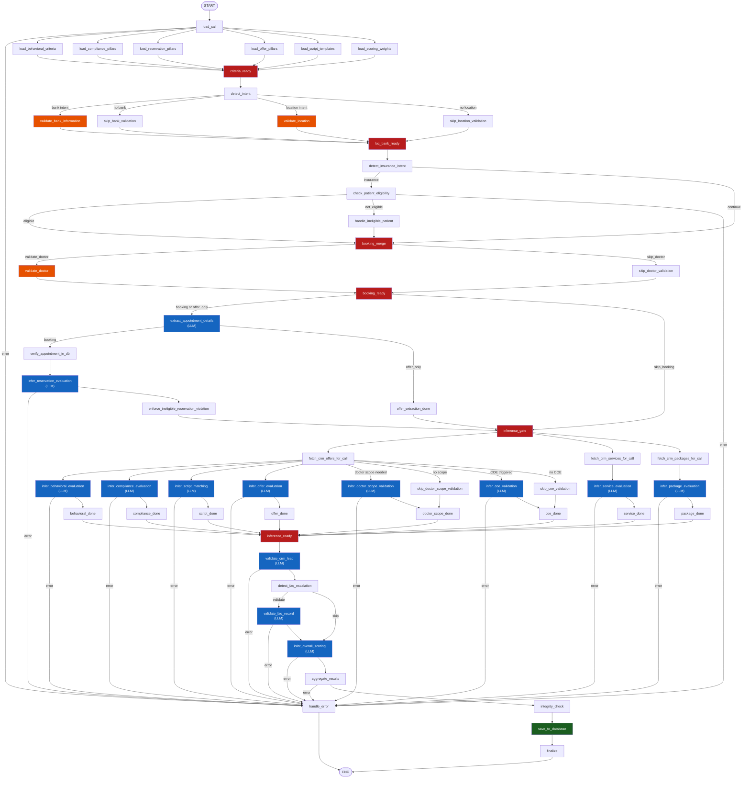

# LangGraph Pipeline Topology

## Full Pipeline



## Inference Fan-Out Stage (Detailed)

```
inference_gate (single entry — exactly 1 arrival per call)
    │
    ├──→ fetch_crm_offers_for_call
    │         │
    │         ├──→ infer_behavioral_evaluation  → behavioral_done ──┐
    │         ├──→ infer_compliance_evaluation  → compliance_done ──┤
    │         ├──→ infer_script_matching        → script_done ──────┤
    │         ├──→ infer_offer_evaluation       → offer_done ───────┤  fan-in
    │         ├──(doctor resolved+need)─→ infer_doctor_scope_validation → doctor_scope_done ──┤
    │         │   (else)─────────────────→ skip_doctor_scope_validation → doctor_scope_done ──┤
    │         ├──(COE trigger)──────────→ infer_coe_validation          → coe_done ───────────┤
    │         └── (no COE)─────────────→ skip_coe_validation            → coe_done ───────────┤
    │                                                                                          │
    ├──→ fetch_crm_services_for_call                                                           │
    │         └──→ infer_service_evaluation  → service_done ────────────────────────────────────┤
    │                                                                                          │
    └──→ fetch_crm_packages_for_call                                                           │
              └──→ infer_package_evaluation → package_done ─────────────────────────────────────┤
                                                                                               │
                                                                              inference_ready ◄─┘
                                                                     (barrier — 8 predecessors)
                                                                                               │
                                                                          validate_crm_lead (LLM)
                                                                                               │
                                                                      detect_faq_escalation
                                                                                               │
                                                                      infer_overall_scoring (LLM)
                                                                                               │
                                                                         aggregate_results
                                                                                               │
                                                                          integrity_check
                                                                                               │
                                                                          save_to_database
                                                                                               │
                                                                              finalize → END
```

## Offer Validation Logic

`fetch_crm_offers_for_call` fetches **all active CRM offers** for the call's
specialty (and gender when available) from Dynamics 365. It passes them as a
compact context block into `infer_offer_evaluation`.

`infer_offer_evaluation` performs **two-way validation**:

| Scenario | Outcome | Flag |
|---|---|---|
| Agent mentioned an offer AND it matches a live CRM offer | `SUITABLE_OFFER_RECOMMENDED` | ✅ positive |
| Agent mentioned an offer but details are wrong (price/date/specialty) | `OFFER_MISREPRESENTED` | ⚠️ C2B moderate |
| Agent mentioned an irrelevant/unmatched offer | `UNRELATED_OFFER_RECOMMENDED` | ⚠️ C2B moderate |
| A relevant CRM offer existed but agent never mentioned it | `OFFER_SKIPPED` | ⚠️ C2B moderate |
| Agent mentioned offer but omitted price or expiry | `INCOMPLETE_OFFER_PRESENTATION` | NC minor |
| Agent didn't ask patient to book after presenting offer | `MISSING_OFFER_CONFIRMATION_ASK` | NC minor |
| No active CRM offer for this specialty | `NO_OFFER_AVAILABLE` | — none |
| Non-booking call type | `OFFER_NOT_APPLICABLE` | — none |

## Key Design Decisions

### 1. Barrier Nodes (loop-prevention)
- **`criteria_ready`** (6 predecessors): waits for all 6 YAML loaders
- **`loc_bank_ready`** (4 predecessors): waits for bank pair + location pair
- **`booking_merge`** (≤3 predecessors): merges insurance/eligibility paths before doctor routing
- **`booking_ready`** (2 predecessors): waits for doctor branch — single entry into booking router
- **`inference_gate`** (1 predecessor per call): single fan-out point, never reached twice
- **`inference_ready`** (8 predecessors): one `*_done` per parallel branch

### 2. Why the old graph looped
The previous wiring had three root causes:
1. `loc_bank_ready` had **6** predecessors (bank×2 + location×2 + doctor×2) so it fired 3 times, triggering `extract_appointment_details` 3 times.
2. `infer_package_evaluation` was missing its `builder.add_conditional_edges` call (bare tuple) so `package_done` was never set and `inference_ready` retried.
3. `infer_doctor_scope_validation` and `infer_coe_validation` went directly to `inference_ready` (bypassing `*_done` barriers) giving it an inconsistent predecessor count.

### 3. Booking Branch
Runs **sequentially** (extract → verify → infer_reservation) before the parallel inference fan-out. Ineligible patients still pass through `booking_merge` → `booking_ready` → booking router so the reservation is checked for improper bookings.

### 4. Error Routing
Every fallible node has a conditional edge to `handle_error → END`.

### 5. Database Write
`save_to_database` is **non-fatal** — errors are logged but don't set `state["error"]`.

## Node Summary

| Node | Type | Description |
|------|------|-------------|
| `load_call` | validation | Entry — checks `CallTranscript` exists |
| `load_*` | loader | YAML criteria reads (lru_cached) |
| `criteria_ready` | barrier | Waits for 6 loaders |
| `detect_intent` | keyword scan | Booking/offer keywords (احجز, حجز, عرض…) |
| `validate_bank_information` | deterministic | KSA bank-account check |
| `validate_location` | deterministic | KSA branch/location check |
| `loc_bank_ready` | barrier | Waits for bank + location branches (4) |
| `detect_insurance_intent` | keyword scan | IQAMA / insurance detection |
| `check_patient_eligibility` | API | Beneficiary insurance eligibility check |
| `booking_merge` | barrier | Merges insurance/ineligible paths |
| `validate_doctor` | deterministic+LLM | Doctor CRM resolution + field validation |
| `booking_ready` | barrier | Single entry into booking router |
| `extract_appointment_details` | LLM | Date, doctor, specialty, patient, offer name |
| `verify_appointment_in_db` | SQL | Fuzzy-match reservation lookup |
| `infer_reservation_evaluation` | LLM | 6 reservation pillars |
| `inference_gate` | barrier | Single fan-out into parallel inference |
| `fetch_crm_offers_for_call` | CRM | Active offers for specialty + gender |
| `fetch_crm_services_for_call` | CRM | Active services for specialty |
| `fetch_crm_packages_for_call` | CRM | Active packages for specialty |
| `infer_behavioral_evaluation` | LLM | Tone, empathy, professionalism, red flags |
| `infer_compliance_evaluation` | LLM | 15 compliance pillars |
| `infer_script_matching` | LLM | Greeting/closing script adherence |
| `infer_offer_evaluation` | LLM | Two-way offer validation (agent + CRM) |
| `infer_service_evaluation` | LLM | Service price/name accuracy |
| `infer_package_evaluation` | LLM | Package price/name accuracy |
| `infer_doctor_scope_validation` | LLM | Doctor CRM scope vs patient clinical need |
| `infer_coe_validation` | LLM | Center of Excellence recommendation check |
| `inference_ready` | barrier | Waits for 8 `*_done` nodes |
| `validate_crm_lead` | LLM | CRM lead field accuracy |
| `detect_faq_escalation` | keyword | FAQ escalation claim detection |
| `validate_faq_record` | LLM | FAQ record match validation |
| `infer_overall_scoring` | LLM | Synthesizes all sub-results |
| `aggregate_results` | merge | Combines outputs → `QAAnalysisResult` |
| `integrity_check` | validation | Fixes escalation ↔ assessment mismatches |
| `save_to_database` | SQL INSERT | Persists to `[DWH].[AI].[Call_QA_Results]` |
| `finalize` | logging | Logs summary, closes trace |
| `handle_error` | error sink | Converts failure to safe error result |