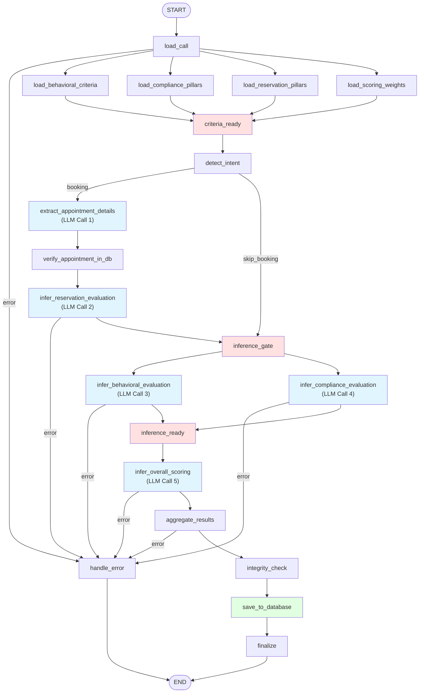

# LangGraph Pipeline Topology

## Full Pipeline



## Focused Inference Stage (Detailed)

```
criteria_ready
    │
    └──→ detect_intent (keyword-based, instant)
              │
              ├──(booking)──→ extract_appointment_details (LLM)
              │                        │
              │               verify_appointment_in_db (SQL)
              │                        │
              │               infer_reservation_evaluation (LLM)
              │                        │
              └──(skip)────────────────┘
                          │
                          ▼
                  inference_gate (barrier — single fan-out point)
                          │
          ┌───────────────┴───────────────┐
          │                               │
          ▼                               ▼
  infer_behavioral_evaluation   infer_compliance_evaluation
      (LLM — tone, empathy)       (LLM — 15 pillars)
          │                               │
          └───────────────┬───────────────┘
                          │ (exactly 2 triggers)
                          ▼
                  inference_ready (barrier)
                          │
                          ▼
              infer_overall_scoring (LLM — synthesis)
                          │
                          ▼
              aggregate_results (merge all sub-results)
                          │
                          ▼
              integrity_check (fix escalation mismatches)
                          │
                          ▼
              save_to_database (INSERT to SQL Server)
                          │
                          ▼
                      finalize
```

## Key Design Decisions

### 1. Barrier Nodes
- **`criteria_ready`**: waits for all 4 YAML loaders before detect_intent fires
- **`inference_gate`**: waits for booking branch OR skip, then fans out to behavioral + compliance
- **`inference_ready`**: waits for both behavioral + compliance before scoring synthesis

### 2. Booking Branch
Runs **sequentially** (extract → verify → infer_reservation) **before** the parallel behavioral + compliance calls. This ensures appointment verification context is available if reservation flags need to reference it.

### 3. Error Routing
Every fallible node (`load_call`, all LLM nodes, `aggregate_results`) has a conditional edge to `handle_error`. Errors short-circuit to `END` immediately — no downstream nodes execute.

### 4. Database Write
`save_to_database` is **non-fatal**: DB insert errors are logged but don't set `state["error"]`, so the pipeline continues to `finalize` and returns the in-memory result to the caller.

## Node Summary

| Node | Type | Description |
|------|------|-------------|
| `load_call` | validation | Entry point — checks `CallTranscript` exists |
| `load_*_criteria` | loader | Reads YAML files (lru_cached) |
| `criteria_ready` | barrier | No-op synchronization point |
| `detect_intent` | keyword scan | Checks for booking keywords (احجز, حجز, etc.) |
| `extract_appointment_details` | LLM | Extracts date, doctor, specialty, patient name |
| `verify_appointment_in_db` | SQL | Queries live reservations DB (fuzzy match) |
| `infer_reservation_evaluation` | LLM | Checks 6 reservation pillars |
| `inference_gate` | barrier | Single fan-out point after booking branch |
| `infer_behavioral_evaluation` | LLM | Tone, empathy, professionalism, red flags |
| `infer_compliance_evaluation` | LLM | 15 compliance pillars (C2Com/C2C/C2B/NC) |
| `inference_ready` | barrier | Waits for behavioral + compliance |
| `infer_overall_scoring` | LLM | Synthesizes sub-results into final assessment |
| `aggregate_results` | merge | Combines all LLM outputs into `QAAnalysisResult` |
| `integrity_check` | validation | Fixes escalation_required ↔ overall_assessment mismatches |
| `save_to_database` | SQL INSERT | Persists to `[DWH].[AI].[Call_QA_Results]` |
| `finalize` | logging | Logs summary, closes trace |
| `handle_error` | error sink | Converts pipeline failure to safe error result |