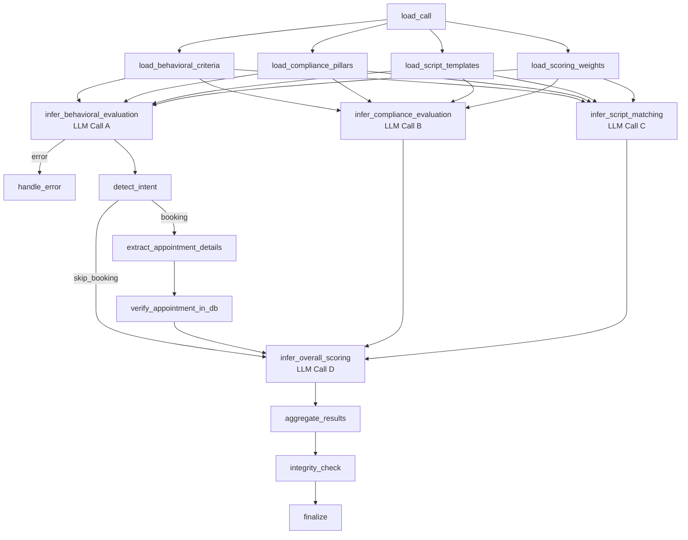
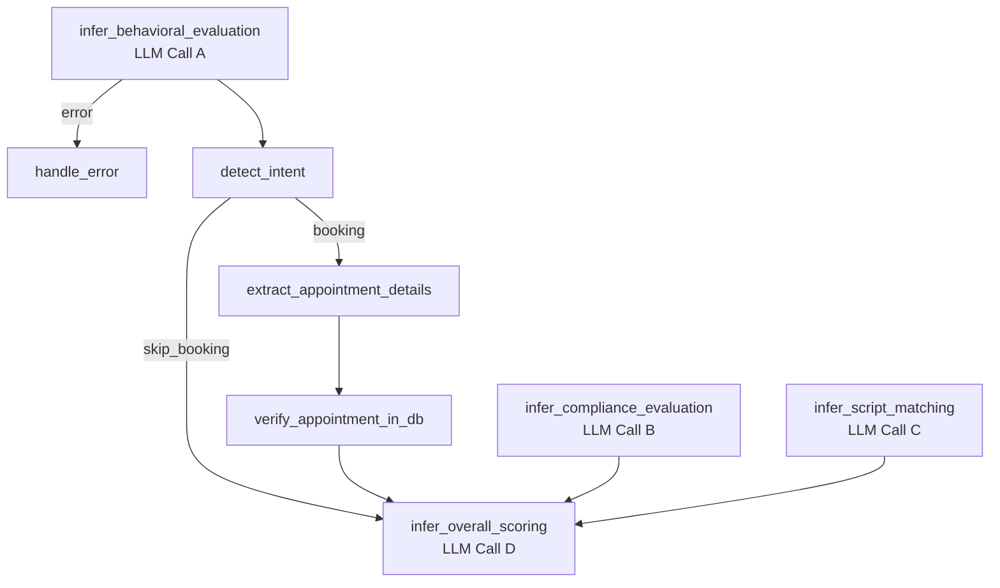

criteria_ready
    │
    └──→ detect_intent (sequential)
              │
              ├──(booking)──→ extract → verify → infer_reservation_evaluation
              │                                          │
              └──(skip)──────────────────────────────────┘
                                   │ (always sequential, finishes completely)
                                   ▼
              ┌────────────── infer_behavioral_evaluation ◄── criteria_ready
              │               infer_compliance_evaluation ◄── criteria_ready
              │                        │ fan-in (exactly 2, unconditional)
              │                        ▼
              │                inference_ready
              │                        │
              │                        ▼
              └──────────────► infer_overall_scoring → aggregate → integrity_check → finalize